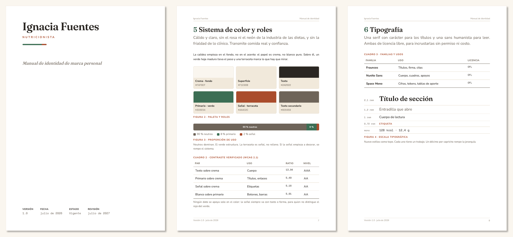
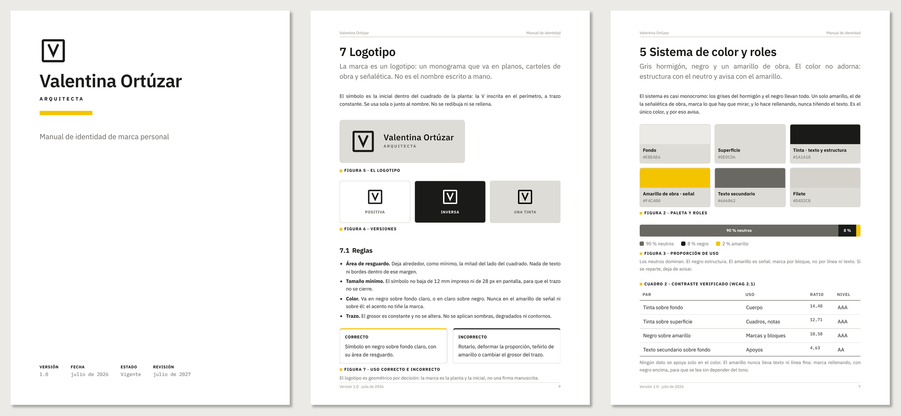

**English** · [Español](README.es.md)

# Identidad Personal

A Claude Code skill that guides you, through questions, to build your own personal brand identity manual, and hands it to you finished.

> Works in Spanish and English. The skill detects your language or asks at the start.

## 1. What it is and who it is for

A personal brand identity manual sets how everything you produce looks and sounds: color, type, layout and voice, decided once so you do not re-argue them on every piece.

This skill does not give you a template to fill in or a logo thrown together on the spot. It walks you through the method that produces that manual with judgment: it closes each design decision before moving to the next, explains why one option beats another, and stops to consult you when the choice is yours. The result is a system of your own, not your name dropped onto someone else's template.

It is for people who put out work under their own name and want it to look and sound consistent without hiring a design studio: independent professionals, consultants, teachers, founders.

## 2. What it does / What it does not do

**What it does**

- Runs the process of building your personal brand identity manual: what to ask, in what order, what to settle before moving on, and when to stop and consult.
- Makes you take the design decisions with judgment, not by picking from a menu: color direction, type, hierarchy, signature or logo, layout.
- Delivers the finished manual as a self-contained HTML file, ready to print to a paginated PDF from a Chromium browser.
- Delivers, alongside it, a **one-page identity card**: the palette, the type, the signature and the rules that get broken most often, on a single sheet. It is what you keep open while you work, and what you hand to whoever produces something on your brand. The manual settles the arguments; the card carries the values.
- Documents and systematizes your logo if you already have one, or builds the typographic name signature if you do not.
- Leaves the system tokens (colors by role, type scale, light and dark versions) so you can reuse the identity on other pieces.

**What it does not do**

- It does not design your logo or any graphic mark. It documents one that already exists; it does not draw it.
- It does not fill a template with your data. It is a method, not a form. Without your decisions, you get a correct manual with no character.
- It does not invent your purpose or positioning. It helps you articulate what you already do, not manufacture an identity you do not have.
- It does not do corporate identity. This is one person's brand, not a company's.
- It does not produce photography or illustration, nor run your social accounts or content plan. It is the visual and verbal system, not the distribution strategy.
- It does not itself produce a Word .docx. The skill delivers the HTML and its PDF; for the editable one there is a path through [`ooxmlkit`](https://github.com/Carlos-Padilla-Bravo/ooxmlkit), set out below with its two requirements.
- It does not replace a designer when the job goes beyond a documented system.

## 3. How it works

The skill asks you questions and you answer. From that it steers the design to your preferences, closes each decision before moving to the next, and hands you the manual at the end.

You do not bring files written in advance. What would otherwise be your profile or your tone, the skill builds by asking. If you already have a bio or notes about yourself, you can hand them over to go faster, but they are not required.

The path has three moments:

**Foundation: who you are.** First, what is not seen. The skill draws out, one decision at a time, your essence (what you do in one sentence), your territory (which areas you work in and what stays out), your purpose, your personality (marked with opposing examples: closer or more reserved, more technical or more approachable), your audiences and your tone. This steers everything visual: the system translates who you are, not the other way around.

**Visual system: how it looks.** With the foundation closed, the skill builds the color (direction first, then the values: a dominant neutral, a primary and a rationed signal color, with contrast verified by number), the type (character first, then a freely licensed family and a hierarchy with a cap on styles), your signature or your logo depending on what you have, and the layout. At the points that are costly to reverse (color, type and signature), it stops to consult you before setting anything.

**The deliverable.** The skill assembles the manual as a single-page, self-contained HTML file, with the fonts embedded and no external dependencies, in a light and a dark version. On screen it reads as one flow; printed to PDF from a Chromium browser it comes out paginated, with page numbers, header and footer. It closes with the token sheet (colors by role, type scale, families) so you can reuse the identity on other pieces. And it hands you the one-page card: a manual has to justify itself and runs long, but nobody opens forty pages to check a hex value, so the values you use every day live on a sheet of their own.

## 4. Requirements

- **Claude Code**, or an environment that supports skills. It is the engine that runs the skill; without it, copying the folder does nothing.
- **A Chromium browser** (Chrome or Edge) for the paginated PDF: print with "Background graphics" on. Nothing else is needed, and it runs on any system. On screen the manual reads without any of that.

## 5. Installation

This skill is a folder with a `SKILL.md` file inside. Installing it means putting that folder where Claude Code looks for its skills.

1. **Download the repository.** With GitHub Desktop, clone it; or from the repo page, "Code" → "Download ZIP" and unzip it.
2. **Place it in your skills folder** named `identidad-personal`, so that `SKILL.md` lands here:

   - macOS and Linux: `~/.claude/skills/identidad-personal/SKILL.md`
   - Windows: `%USERPROFILE%\.claude\skills\identidad-personal\SKILL.md`, that is `C:\Users\YOUR-USER\.claude\skills\identidad-personal\SKILL.md`

   The command comes from the folder name, so it must be `identidad-personal`. To install it for one project only, use `.claude/skills/identidad-personal/` inside that project instead of your personal folder.
3. **Restart Claude Code** if the `skills` folder did not exist before; if it already existed, the skill shows up without restarting.

To use it, ask Claude to build your personal brand identity manual, or invoke it directly with `/identidad-personal`.

## 6. Language

The skill works in Spanish and English. It detects your language or asks at the start, and produces the manual in the language you choose.

## 7. Sample cases

The repo includes two full manuals built with the skill, one for each branch of the mark decision. Both people are fictional, made for this; neither manual is real. The sample manuals are written in Spanish.

**Ignacia Fuentes**, a nutritionist working in consultation and outreach, warm and close in tone. Her mark is a **name signature**, no logo. A warm palette (cream, a primary green and a terracotta signal) and the families Fraunces, Nunito Sans and Space Mono.

**Valentina Ortúzar**, an architect, precise and structural in tone. Her mark is a **logo**: a geometric monogram, so her manual documents the logo module (versions, clear space, minimum size, correct and incorrect uses). Warm concrete neutrals under a cool **blueprint blue** that structures and numbers, with a hi-vis construction-yellow signal that marks by filling rather than tinting text, and the IBM Plex family.

Both start from opposite tones, to show that the system draws out each person's character rather than imposing one. Each case ships the full deliverable: the manual, which opens in any browser (`.html`) or reads as a paginated PDF, and its **one-page identity card**.

- Ignacia: manual [`.html`](ejemplo/manual-ignacia.html) · [`.pdf`](ejemplo/manual-ignacia.pdf), 13 pages — card [`.html`](ejemplo/ficha-ignacia.html) · [`.pdf`](ejemplo/ficha-ignacia.pdf)
- Valentina: manual [`.html`](ejemplo/manual-valentina.html) · [`.pdf`](ejemplo/manual-valentina.pdf), 15 pages — card [`.html`](ejemplo/ficha-valentina.html) · [`.pdf`](ejemplo/ficha-valentina.pdf)

The two cards are worth reading side by side: same structure, and still they look nothing alike, because each is composed in its owner's own values. Both ship in the dark version, which is the right call for a piece consulted on a screen; the button in the corner switches to light.

## 8. What your manual is for

An identity manual is not a document you file away. It is the single source that keeps everything you produce afterward coherent. Once it is built you can:

- **Turn it into an identity skill that talks to other skills.** Your manual can become a skill the others consult: the one for presentations, for reports, for web pages. Each produces its piece by reading your identity from a single source, without you re-deciding the color or the type every time, and without the pieces drifting apart.
- **Hand it to whoever works with you.** A designer or a collaborator produces on your brand without supervision, because the rules are already written.
- **Resolve new cases with judgment.** When something the manual did not foresee comes up, its decisions tell you what is coherent with your brand and what is not.
- **Make your work recognizable over time.** Consistency is the asset: pieces made months apart read as coming from the same person.

## 9. What if I want it in Word?

This skill delivers the manual as HTML, which prints the formal paginated PDF on any platform. If you also need an editable `.docx`, the path exists and it is this:

1. Finish your manual with this skill. The decisions you make here are the ones that get typeset there.
2. Ask Claude Code to typeset it in Word with [`ooxmlkit`](https://github.com/Carlos-Padilla-Bravo/ooxmlkit), starting from its worked example. You do not need to write the program: that example is the complete manual of one of the two people here, and the work is swapping her decisions for yours.

**Two requirements this skill does not have.** Closing the document needs **Windows with Microsoft Word**, because the table of contents and the page total are fields only Word resolves. And the fonts have to be installed on the machine, or Word substitutes silently and the manual ends up contradicting what it declares about itself. On macOS or Linux, the HTML and its PDF are the whole route.

`ooxmlkit` is not part of this skill and does not use it: two separate things on purpose, one decides and the other typesets.

## 10. License and status

Released under the **MIT** license. Copyright (c) 2026 Carlos Padilla Bravo. You may use, copy and modify the skill, including in paid work, keeping the authorship notice.

**Status: maintained occasionally.** The skill is updated when the author's own identity manual evolves and the lesson generalises beyond his case. There is no promise of support or response times, and issues are disabled, so this is not a support channel. Fork it freely: that is what the MIT license above is for.

---

Author: **Carlos Padilla Bravo**
